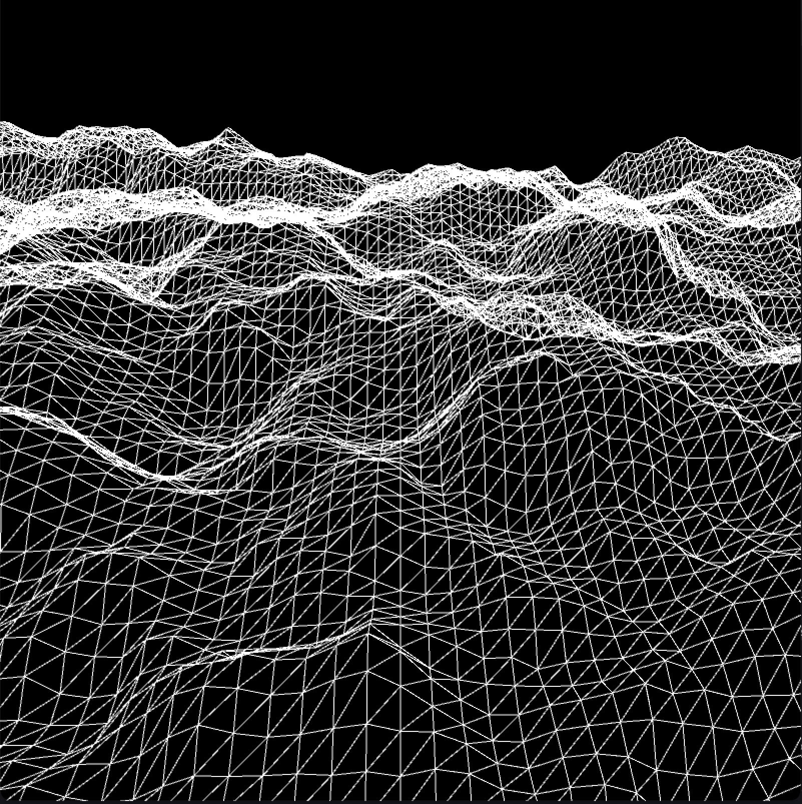

# WT WAVE TERRAIN SYNTHESIS USING PERLIN NOISE  



WT is a powerful tool (in python) for generating and manipulating sounds through wave terrain synthesis, where surfaces are shaped using Perlin noise.  

>*terrain generation*

    ```python
    from terrain import Terrain

    terrain = Terrain(size=(WIDTH, HEIGHT), xy_incr=(0.01, 0.01))
    ```

>*generate envelope*

```python
from envelopes import EnvelopeTypes, Envelope

envelope = Envelope(

envelope_type=EnvelopeTypes.ADSR, 
dur=ENVELOPE_DUR,
sr=SR,
atk=0.001, 
decay=0, 
release=ENVELOPE_DUR - 0.001, 
sustain_amp=1.0, 
initial_amp=0.0001, 
end_amp=0.0001, 
mode="exp"

)

envelope.show_env()
```

>*generate orbit and add envelope to orbit*

```python
from orbits import OrbitTypes, Orbit

orbit = Orbit(orbit_type=OrbitTypes.SPIRAL, center=(0.5, 0.5))
orbit.envelope = envelope

orbit.show_orbit(period=1 / SR)
```

>*wave terrain synthesis*

```python
from wave_terrain import WaveTerrainSynthesis

wt = WaveTerrainSynthesis(sr=SR)
wt.terrain = terrain
wt.orbit = orbit
```

>*generate sample by sample*

```python
y = np.zeros(SAMPLE_DUR, dtype=np.float64)
for i in range(SAMPLE_DUR):
    sample = wt.get_sample(freqs=(FREQX, FREQY), haptic_freq=HAPTIC_FREQ, max_r=0.707)
    y[i] = sample
# master envelope
y *= np.hanning(SAMPLE_DUR)
```
